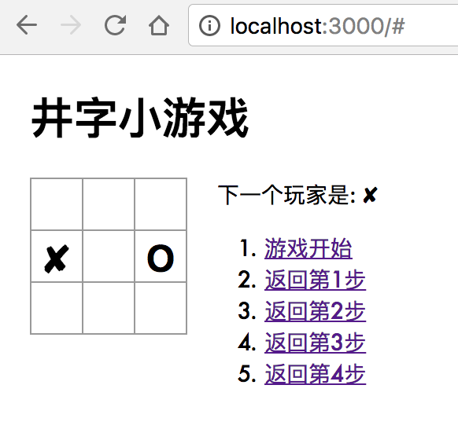

# React-Tutorial-tic-tac-toe-game
React官方教程：井字游戏

## 1.克隆到本地
1. `$ git clone https://github.com/bbbbx/React-Tutorial-tic-tac-toe-game.git`

2. `$ cd React-Tutorial-tic-tac-toe-game`

## 2.运行本地服务器
`$ npm install`安装依赖
`$ npm start`

## 3.在浏览器中预览
打开浏览器，在地址栏输入`localhost:3000`。

## 4.截屏

## 5.要求
安装Node以及npm。
