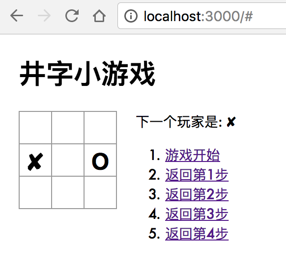
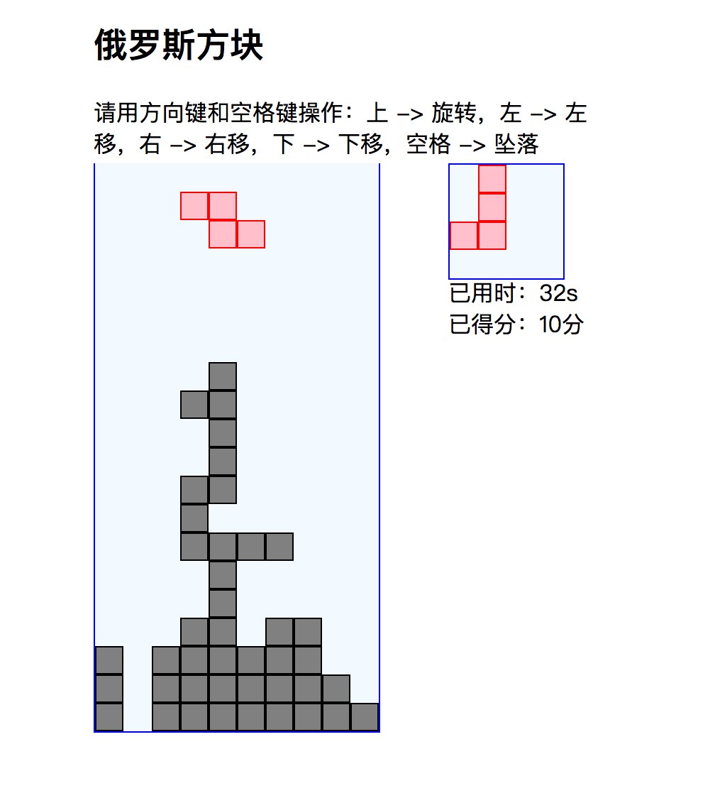

# js-game
一些前端的小游戏 demo

## [tic-tac-toe](http://venusworld.cn/js-game/tic-tac-toe/build)
基于`ReactJS`的井字游戏：[live demo](http://venusworld.cn/js-game/tic-tac-toe/build)

脚手架：`create-react-app`

#### 1. 克隆到本地
  1. `$ git clone https://github.com/bbbbx/js-game.git`

  2. `$ cd js-game/tic-tac-toe`

#### 2. 运行本地服务器
`$ npm install`安装依赖
`$ npm start`

#### 3. 在本地中预览
打开浏览器，在地址栏输入`localhost:3000`。

#### 4. 截屏

#### 5. 打包
`$ npm run build`

## [tetris](http://venusworld.cn/js-game/tetris)
原生`JS`的俄罗斯方块：[live demo](http://venusworld.cn/js-game/tetris)
#### 截屏

